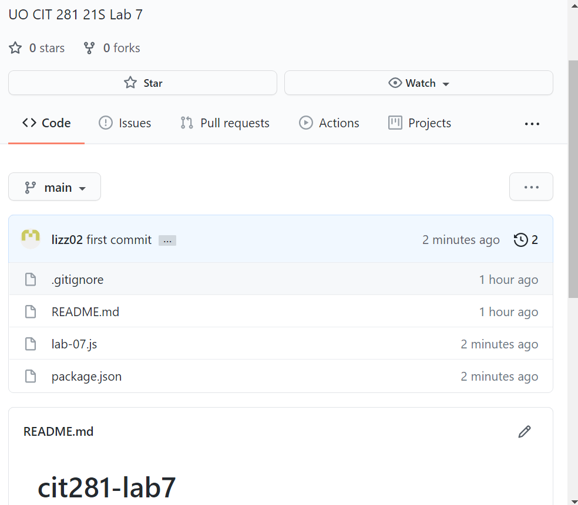

## Techniques Used 

- Making organizations on github
- Non-web server Node.js JavaScript code
    - Functions
    - Classes
    - Class inheritance
    - constructor() method
    - try...catch statements
    - console.log() method

## Objectives

### Create a block of code to practice handling errors using try...catch operators and class inheritance. 

```
class CustomError extends Error {
    constructor(arg){
        super(arg);
        this.name = "Error";
    }
}
function throwGenericError() {
     throw new Error("Generic error")
 }
function throwCustomError(){
    throw new Error("Custom error")
}


try {
    console.log("Force generic error")
    console.log("Generic error try block")
    throwGenericError()
} catch(err){
    console.log("Generic error catch block")
    console.log(`${err.name}: ${err.message}`)

}finally{
console.log("Generic error finally block")
}

try {
    console.log("Force custom error")
    console.log("Custom error try block")
    throwCustomError()
} catch(err){
    console.log("Custom error catch block")
    console.log(err.name + ": " + err.message)
}finally{
    console.log("Custom error finally block")
}
```
### Practice making organizations on github.


